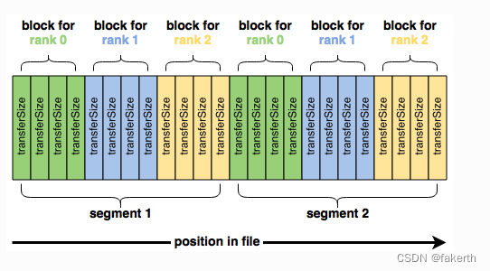

## 0415

```sh

1. 执行多线程 IOR N-1 test, sequential accesses with one target
    ./run.sh
    基本指令如下
    ./ior -w -r -i 3 --posix.odirect -t 8m -b 16g -g -d 3 -e -E -o $outfile -s 1
2. 执行多线程 IOR N-N test, sequential accesses with one target
    ./run_nn.sh
```

PS: 
```sh
[node9:86396] 1 more process has sent help message help-mpi-btl-openib.txt / no device params found
[node9:86396] Set MCA parameter "orte_base_help_aggregate" to 0 to see all help / error messages
[node9:86396] 2 more processes have sent help message help-mpi-btl-openib-cpc-base.txt / no cpcs for port
不用管这个：报错提示，测试比较慢，是可以正常运行的
```

### IOR 参数选项
IOR使用以下参数顺序写入数据：

blockSize( -b)
transferSize( -t)
segmentCount( -s)
numTasks( -n)


```sh
-a S	api – I/O API [POSIX|MPIIO|HDF5|HDFS|S3|S3_EMC|NCMPI|RADOS]
-A N	refNum – 要包含在长摘要中的用户参考号
-b N	blockSize – 每个任务要写入的连续字节（例如：8、4k、2m、1g）
-c	集体 – 集体 I/O
-C	reorderTasksConstant – 将任务排序更改为 n+1 排序以便回读
-d N	interTestDelay – 重复次数之间的延迟（以秒为单位）
-D N	DeadlineForStonewalling – 停止写入或读取阶段之前的秒数
-e	fsync – 在 POSIX 写关闭时执行 fsync
-E	useExistingTestFile – 在写访问之前不删除测试文件
-f S	scriptFile – 测试脚本名称
-F	filePerProc – 每个进程文件
-g	intraTestBarriers – 在打开、写入/读取和关闭之间使用屏障
-G N	setTimeStampSignature – 设置时间戳签名的值
-h	showHelp – 显示选项和帮助
-H	showHints – 显示提示
-i N	重复次数——测试的重复次数
-I	individualDataSets – 并非所有进程共享的数据集[不工作]
-j N	outlierThreshold – 对距离平均值 N 秒的异常值发出警告
-J N	setAlignment – 以字节为单位的 HDF5 对齐方式（例如：8、4k、2m、1g）
-k	keepFile – 程序退出时不删除测试文件
-K	keepFileWithError – 数据检查后保留填充错误的文件
-l	数据包类型 – 将创建的数据包类型 [offset|incompressible|timestamp|o|i|t]
-m	multiFile – 使用代表次数 (-i) 进行多个文件计数
-M N	memoryPerNode – 占用节点上的内存（例如：2g，75%）
-n	noFill – HDF5 文件创建时不填充
-N N	numTasks – 应参与测试的任务数
-o S	testFile – 测试的全名
-O S	IOR 指令字符串（例如 -O checkRead=1,GPUid=2）
-p	预分配 – 预分配文件大小
-P	useSharedFilePointer – 使用共享文件指针[不起作用]
-q	quitOnError – 在文件错误检查期间，出错时中止
-Q N	用于读取测试的 taskPerNodeOffset 与 -C 和 -Z 选项一起使用（-C 常量 N，-Z 至少 N）[!HDF5]
-r	readFile – 读取现有文件
-R	checkRead – 读取后检查读取
-s N	SegmentCount – 段数
-S	useStridedDatatype – 将跨步访问放入数据类型中[不起作用]
-t N	TransferSize – 传输大小（以字节为单位）（例如：8、4k、2m、1g）
-T N	maxTimeDuration – 运行测试的最长时间（以分钟为单位）
-u	uniqueDir – 每个进程的每个文件使用唯一的目录名称
-U S	hinsFileName – 提示文件的全名
-v	verbose – 输出信息（重复标志增加级别）
-V	useFileView – 使用 MPI_File_set_view
-w	writeFile – 写入文件
-W	checkWrite – 写入后检查读取
-x	singleXferAttempt – 如果不完整，请勿重试传输
-X N	reorderTasksRandomSeed – -Z 选项的随机种子
-Y	fsyncPerWrite – 每次 POSIX 写入后执行 fsync
-z	randomOffset – 访问文件内的随机偏移量，而不是顺序偏移量
-Z	reorderTasksRandom – 将任务排序更改为随机排序以进行回读
```
### past 指令
```sh
ior -w -r -i 3 --posix.odirect -t 8m -b 16g -g -d 3 -e -E -o $outfile -s 1

-w	writeFile – 写入文件
-r	readFile – 读取现有文件
-i N	重复次数——测试的重复次数
-t N	TransferSize – 传输大小（以字节为单位）（例如：8、4k、2m、1g）
-b N	blockSize – 每个任务要写入的连续字节（例如：8、4k、2m、1g）
-g	intraTestBarriers – 在打开、写入/读取和关闭之间使用屏障
-d N	interTestDelay – 重复次数之间的延迟（以秒为单位）
-e	fsync – 在 POSIX 写关闭时执行 fsync
-E	useExistingTestFile – 在写访问之前不删除测试文件
-o S	testFile – 测试的全名
-s N	SegmentCount – 段数
# 
-a S	api – I/O API [POSIX|MPIIO|HDF5|HDFS|S3|S3_EMC|NCMPI|RADOS]


ior -w -r -i 3 --posix.odirect -t 4k -b 1g -g -d 3 -e -E -o /mnt/beegfs/test.ior -s 1

ior -w --posix.odirect -t 4k -b 1g -e -E -o /mnt/beegfs/test.ior -s 1

./ior -t 1m -b 16g -e -E -o /mnt/beegfs/test.ior -s 1
./ior -t 4k -b 1g -e -E -o /mnt/beegfs/test.ior -s 1

# 可以正常执行的
./ior --posix.odirect -t 4k -b 1g -e -E -o /mnt/beegfs/test.ior -s 1

./ior -t 1m -b 16m -s 16 -e
./ior -t 4k -b 2g -e -E -o /mnt/beegfs/test.ior -s 1
```

